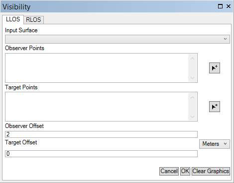

# Visibility

These visibility component uses elevation data paired with observer and target information to produce Linear Line of Sight (LLOS) and Radial Line of Sight (RLOS) information.

 

## Features

* Linear Lines of sight (LLOS)
* Radial Line of Sight (RLOS)
* Specifying observer and target locations by entering inputs manually or by clicking on the map 
* Use one or multiple observers and one or multiple targets to perform analysis 
* Add-in for ArcGIS Pro and ArcMap 

## Sections

* [Requirements](#requirements)
* [Instructions](#instructions)
* [Resources](#resources)
* [New to Github?](#new-to-github)
* [Issues](#issues)
* [Contributing](#contributing)
* [Repository Points of Contact](#repository-points-of-contact)
* [Licensing](#licensing)

## Requirements

### Run Requirements

* Add-Ins for ArcGIS for Desktop
    * ArcMap 10.3.1+
    * ArcGIS Pro 2.1+
    * 3D Analyst and Spatial Analyst extensions installed and licensed

### Build Requirements 

##### Obtain the Dependent Repositories

* Clone this repository
* Clone the following component repository *to the same root folder location* 
	* [coordinate-conversion-addin-dotnet](https://github.com/Esri/coordinate-conversion-addin-dotnet)
* Your local folder structure should now look like:

```
{Github Clone Location}
+---coordinate-conversion-addin-dotnet
+---visibility-addin-dotnet
```

##### Product Requirements

* Add-Ins for ArcGIS for Desktop
    * Visual Studio 2015
    * ArcGIS for Desktop 
        * ArcMap 10.3.1+
        * ArcGIS Pro 2.1+
    * ArcGIS Desktop SDK for .NET 10.3.1+
        * [ArcGIS Desktop for .NET Requirements](https://desktop.arcgis.com/en/desktop/latest/get-started/system-requirements/arcobjects-sdk-system-requirements.htm)
    * [ArcGIS Pro SDK](http://pro.arcgis.com/en/pro-app/sdk/) 2.1+

## Instructions

Follow the links below to select the desired development/deployment environment.

### Add-ins for ArcMap and ArcGIS Pro 

[Instructions for the Add-ins for ArcMap and ArcGIS Pro are here.](./source/addins)

## Resources

* [ArcGIS for Defense Visibility Component](http://solutions.arcgis.com/defense/help/visibility/)
* [Military Tools for ArcGIS](https://esri.github.io/military-tools-desktop-addins/)
* [Military Tools for ArcGIS Solutions Pages](http://solutions.arcgis.com/defense/help/military-tools/)
* [ArcGIS for Defense Solutions Website](http://solutions.arcgis.com/defense)
* [ArcGIS for Defense Downloads](http://appsforms.esri.com/products/download/#ArcGIS_for_Defense)
* [ArcGIS Pro Help](http://pro.arcgis.com/en/pro-app/)
* [ArcGIS Blog](http://blogs.esri.com/esri/arcgis/)

## New to Github

* [New to Github? Get started here.](https://github.com/Esri/esri.github.com/blob/master/help/esri-getting-to-know-github.html)

## Issues

Find a bug or want to request a new feature?  Please let us know by submitting an [issue](https://github.com/ArcGIS/visibility-addin-dotnet/issues).

## Contributing

Anyone and everyone is welcome to contribute. Please see our [guidelines for contributing](https://github.com/esri/contributing).

## Repository Points of Contact 
Contact the [Military Tools team](mailto:defensesolutions@esri.com)

## Licensing
Copyright 2018 Esri

Licensed under the Apache License, Version 2.0 (the "License");
you may not use this file except in compliance with the License.
You may obtain a copy of the License at:

   http://www.apache.org/licenses/LICENSE-2.0.

Unless required by applicable law or agreed to in writing, software
distributed under the License is distributed on an "AS IS" BASIS,
WITHOUT WARRANTIES OR CONDITIONS OF ANY KIND, either express or implied.
See the License for the specific language governing permissions and
limitations under the License.

A copy of the license is available in the repository's [license.txt](./License.txt) file.
